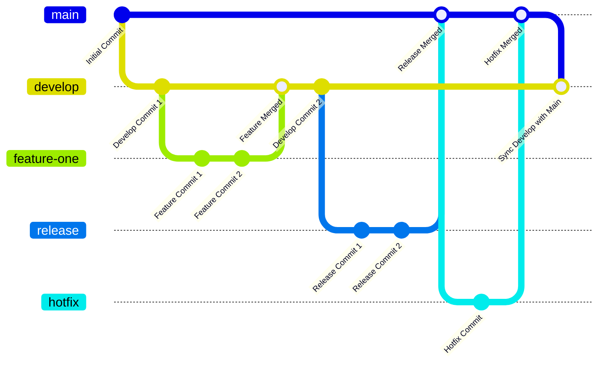

# Getting Started

1. Clone the repository.
2. Understand all the domains of the project.
3. Understand how CQRS and Modular API works.
4. Restore and build the project.
5. Run the project.

> To add new migrations use: `dotnet ef migrations add -s CleanArchitecture.Api -p CleanArchitecture.Infrastructure`

> To update database use: `dotnet ef database update --project CleanArchitecture.Api`

# Build and Test

TODO: Describe and show how to build your code and run the tests.

# Git Workflow

# Contribution

TODO: Explain how other users and developers can contribute to make your code better.

If you want to learn more about creating good readme files then refer the following [guidelines](https://docs.microsoft.com/en-us/azure/devops/repos/git/create-a-readme?view=azure-devops). You can also seek inspiration from the below readme files:

- [ASP.NET Core](https://github.com/aspnet/Home)
- [Visual Studio Code](https://github.com/Microsoft/vscode)
